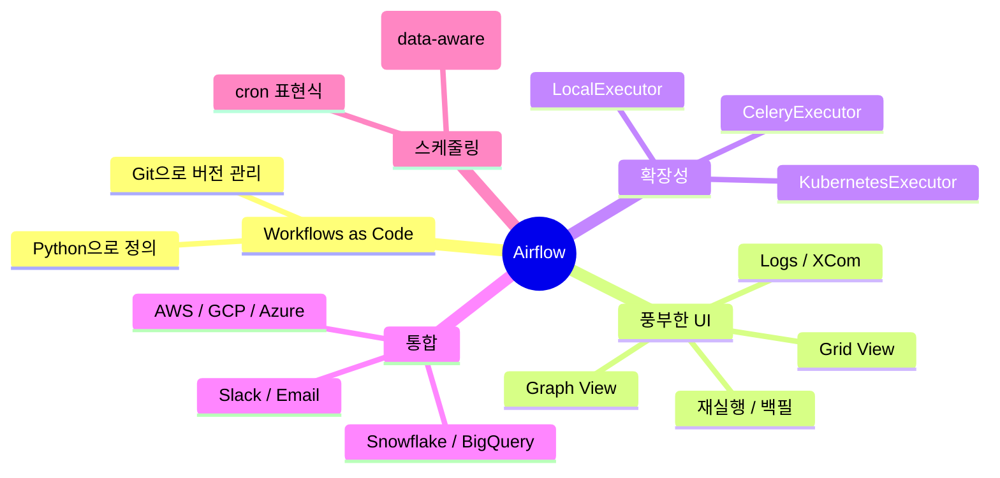

# 01. Airflow 소개

## Airflow란?

**Apache Airflow**는 데이터 파이프라인을 코드(Python)로 작성하고, 스케줄링하고, 모니터링하는 **워크플로우 오케스트레이션 도구**입니다.
2014년 Airbnb에서 시작되어 현재는 Apache Software Foundation의 Top-Level 프로젝트입니다.

> 슬로건: **"Workflows as Code"**

## 어떤 문제를 푸나?

데이터 작업은 보통 여러 단계로 이루어집니다.

```
[원천 DB] → [추출] → [변환] → [적재] → [집계] → [리포트 발송]
```

이런 작업을 cron으로 돌리다 보면 다음과 같은 문제가 생깁니다.

| 문제 | cron의 한계 | Airflow의 해결 |
|------|-----------|--------------|
| 어떤 작업이 실패했는지 모른다 | 로그를 일일이 본다 | Web UI에서 빨간 박스로 표시 |
| 단계 간 의존성이 있다 | shell script로 if/then | DAG로 그래프 표현 |
| 과거 데이터를 다시 처리해야 한다 | 수동 재실행 | **백필(backfill)** 기능 |
| 누구든 어떻게 돌아가는지 모른다 | 문서가 없다 | UI에 코드/실행이력 그대로 노출 |
| 재시도 / 알림 / 타임아웃 | 직접 구현 | Operator 옵션으로 선언만 |

## 핵심 특징



## 어디에 쓰면 좋고, 어디에 쓰면 안 되나?

### 잘 맞는 경우

- **배치 ETL** — 매일 새벽 3시에 어제 데이터 집계
- **ML 학습 파이프라인** — 데이터 추출 → 전처리 → 학습 → 평가 → 배포
- **데이터 마트 빌드** — 여러 원천 테이블을 조인하여 대시보드용 테이블 생성
- **리포트 자동화** — 일/주/월 리포트 생성 후 메일/슬랙 발송

### 잘 맞지 않는 경우

- **스트리밍 / 실시간 처리** — Airflow는 배치 도구입니다. 초/분 단위 처리는 Kafka, Flink, Spark Streaming이 적합합니다.
- **단발성 ad-hoc 쿼리** — 단순 작업까지 DAG로 작성하면 오버엔지니어링.
- **사용자 액션 트리거** — 웹 요청 → 즉시 응답이 필요한 워크플로우는 별도 작업 큐가 적합합니다.

## Airflow 버전 메모

| 버전 | 출시 | 특징 | 비고 |
|------|------|------|------|
| 1.10.x | 2018 | 초기 버전 | EOL |
| 2.0 | 2020-12 | TaskFlow API, Scheduler HA | |
| 2.3 | 2022 | Dynamic Task Mapping | |
| 2.4 | 2022 | **Dataset** 도입 (data-aware scheduling) | |
| 2.7 | 2023 | execution_date → **logical_date** 명시 | |
| 2.9 | 2024 | DatasetAlias, EventDataset | **본 가이드 기준** |
| 3.0 | 2024+ | UI 전면 개편, Edge Worker | 큰 변화 있음 |

> **이 가이드는 Airflow 2.9.x를 기준으로 합니다.** Airflow 3.x에서 변경된 부분은 본문에서 별도로 표기합니다.

## 다음으로

→ [02. 핵심 개념 (DAG / Task / Operator)](02-핵심개념.md)
