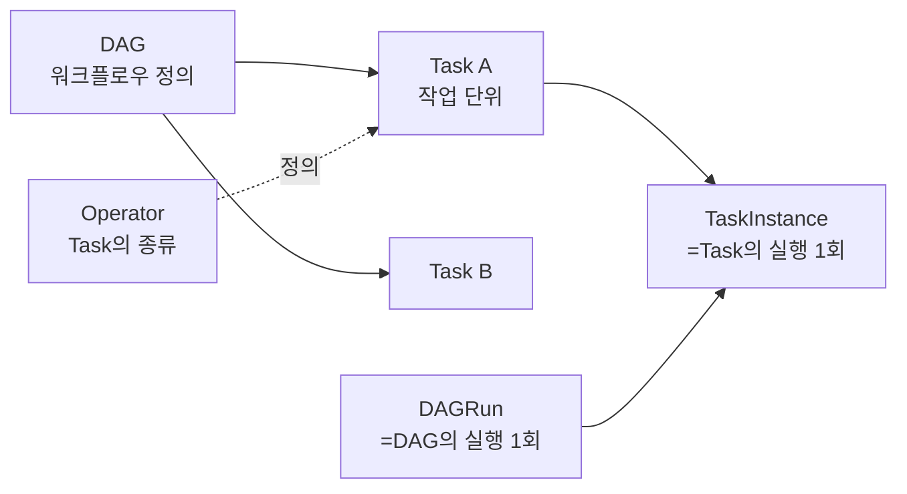
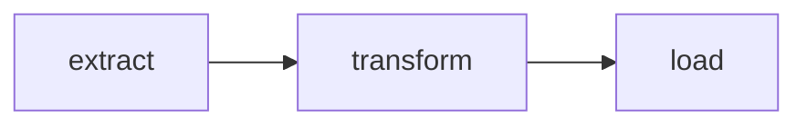

# 02. 핵심 개념 — DAG / Task / Operator

Airflow를 이해하는 데 가장 중요한 5가지 용어입니다.



## 1. DAG (Directed Acyclic Graph)

**DAG = 작업의 흐름을 정의한 그래프**

- **D**irected: 화살표에 방향이 있다 (A → B는 가능, B → A는 불가)
- **A**cyclic: 순환이 없다 (A → B → A 같은 사이클 금지)
- **G**raph: 그래프

### Python으로 DAG 정의하기

```python
from airflow import DAG
from airflow.operators.bash import BashOperator
from datetime import datetime

with DAG(
    dag_id="my_first_dag",
    start_date=datetime(2026, 1, 1),
    schedule="@daily",
    catchup=False,
    tags=["learning"],
) as dag:

    extract = BashOperator(task_id="extract", bash_command="echo 'extract'")
    transform = BashOperator(task_id="transform", bash_command="echo 'transform'")
    load = BashOperator(task_id="load", bash_command="echo 'load'")

    extract >> transform >> load   # 의존성 정의
```



### DAG의 주요 파라미터

| 파라미터 | 의미 | 예시 |
|---------|------|------|
| `dag_id` | DAG 고유 ID (UI에 표시되는 이름) | `"daily_etl"` |
| `start_date` | DAG가 시작될 수 있는 가장 빠른 시각 | `datetime(2026, 1, 1)` |
| `schedule` | 실행 주기 (cron / preset / Dataset) | `"0 3 * * *"`, `"@daily"`, `None` |
| `catchup` | start_date부터 현재까지 못 돌린 것을 자동으로 채울지 | `False` 권장 |
| `max_active_runs` | DAG의 동시 실행 수 제한 | `1` |
| `default_args` | 모든 Task에 공통 적용할 기본 인자 | `{"retries": 2}` |
| `tags` | UI 검색용 태그 | `["etl", "daily"]` |

## 2. Task

**Task = DAG 안의 작업 단위 한 개**

- 하나의 Task는 보통 "한 가지 일"을 함 (SQL 한 개, 파일 하나 다운로드 등)
- Task끼리 의존성을 그림

### Task 의존성 표기법

```python
extract >> transform >> load             # extract → transform → load
[a, b] >> c                              # a, b 모두 완료되면 c
a >> [b, c]                              # a 완료 후 b, c 동시 시작
chain(a, b, c)                           # a → b → c (chain 헬퍼)
```

## 3. Operator

**Operator = Task의 "종류" (템플릿)**

각 Operator는 "이런 종류의 일을 하는 Task를 만든다"라는 클래스입니다.

| Operator | 용도 |
|---------|------|
| `BashOperator` | bash 명령 실행 |
| `PythonOperator` | Python 함수 실행 |
| `EmailOperator` | 이메일 발송 |
| `HttpOperator` (구 `SimpleHttpOperator`) | HTTP 요청 (`apache-airflow-providers-http`) |
| `PostgresOperator` / `MySqlOperator` | SQL 실행 |
| `S3ToRedshiftOperator` | S3 → Redshift 적재 (transfer operator) |
| `KubernetesPodOperator` | K8s Pod 실행 |
| `BranchPythonOperator` | 조건 분기 |
| `EmptyOperator` (구 `DummyOperator`) | 아무것도 안 함 (그래프 정리용) |

> **Sensor**: 특정 조건이 충족될 때까지 대기하는 특수 Operator (`FileSensor`, `S3KeySensor` 등)

### TaskFlow API (Airflow 2.0+)

`@task` 데코레이터로 Python 함수를 그대로 Task로 만들 수 있습니다.

```python
from airflow.decorators import dag, task
from datetime import datetime

@dag(start_date=datetime(2026, 1, 1), schedule="@daily", catchup=False)
def my_pipeline():

    @task
    def extract():
        return {"rows": 100}

    @task
    def transform(data: dict):
        return data["rows"] * 2

    @task
    def load(value: int):
        print(f"Loaded {value}")

    load(transform(extract()))

my_pipeline()
```

> TaskFlow API는 함수 반환값을 자동으로 **XCom**으로 전달합니다.

## 4. DAGRun

**DAGRun = DAG의 "한 번 실행"**

같은 DAG라도 여러 번 실행되면 각각 별개의 DAGRun입니다.

```
DAG: daily_etl
├── DAGRun #1 (2026-01-01)
├── DAGRun #2 (2026-01-02)
├── DAGRun #3 (2026-01-03)  ← 지금 돌고 있음
```

각 DAGRun은 다음을 가집니다.

- `run_id`: 실행 ID (예: `scheduled__2026-01-03T03:00:00+00:00`)
- `logical_date`: 논리적 실행 시각 (이 글에서 핵심!)
- `data_interval_start` / `data_interval_end`: 처리 대상 데이터 구간
- `state`: queued / running / success / failed

## 5. TaskInstance

**TaskInstance = Task의 "한 번 실행"**

DAGRun이 만들어지면, 각 Task마다 TaskInstance가 생성됩니다.

```
DAGRun #3 (2026-01-03)
├── TaskInstance: extract     [success]
├── TaskInstance: transform   [running]
└── TaskInstance: load        [scheduled]
```

각 TaskInstance는 자체 상태/로그/시도 횟수를 가집니다.

## 핵심 개념 정리표

| 개념 | 정의 | 예시 |
|------|------|------|
| **DAG** | 워크플로우 정의 (그래프) | `daily_etl.py` |
| **Task** | DAG 안의 작업 노드 | `extract`, `load` |
| **Operator** | Task를 만드는 템플릿 클래스 | `BashOperator` |
| **DAGRun** | DAG의 1회 실행 | `daily_etl` 2026-01-03 실행 |
| **TaskInstance (TI)** | Task의 1회 실행 | `daily_etl.extract` 2026-01-03 |

## 다음으로

→ [03. Airflow 아키텍처](03-아키텍처.md)
