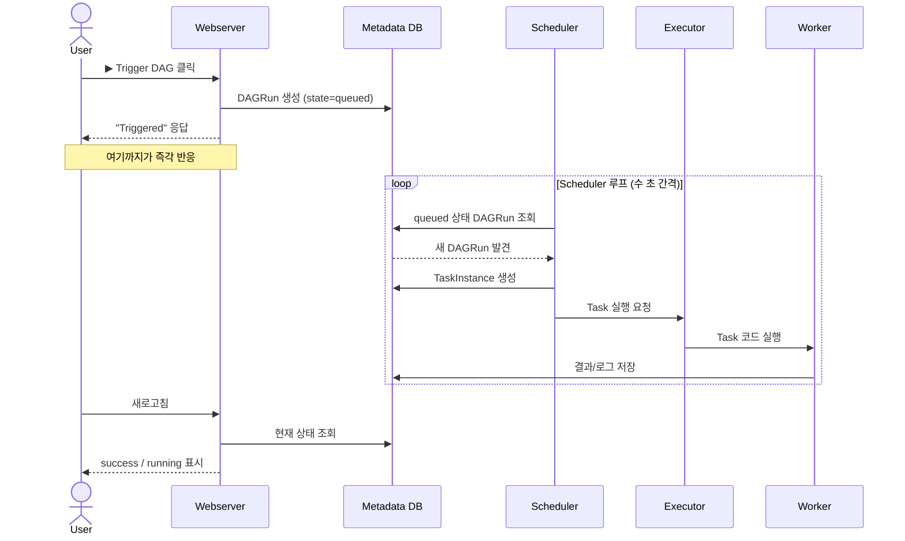
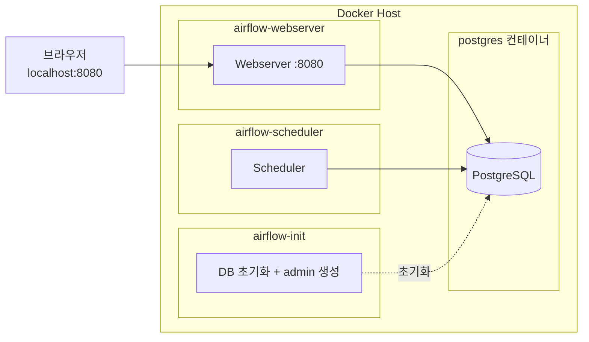

# 03. Airflow 아키텍처

Airflow가 내부적으로 어떻게 굴러가는지 컴포넌트 단위로 설명합니다.
"내가 ▶ 버튼을 눌렀는데 왜 즉시 안 돌까?" 같은 질문에 답할 수 있게 됩니다.

## 전체 그림

```mermaid
graph TB
    subgraph User
        UI[Web UI]
        CLI[airflow CLI]
        API[REST API]
    end

    subgraph "Metadata DB (Postgres/MySQL)"
        DB[(메타데이터)]
    end

    DAGFolder[DAGs 폴더<br/>*.py 파일들]

    subgraph "Core"
        Scheduler[Scheduler<br/>DAG 파싱·스케줄링]
        Webserver[Webserver<br/>UI / API 서빙]
    end

    subgraph "Executor"
        Executor[Executor<br/>Task 실행 위임]
        Worker[Worker<br/>실제 Task 수행]
    end

    UI --> Webserver
    CLI --> DB
    API --> Webserver

    Webserver <--> DB
    Scheduler <--> DB
    Scheduler -.파싱.-> DAGFolder
    Webserver -.표시.-> DAGFolder

    Scheduler --> Executor
    Executor --> Worker
    Worker --> DB
```

## 컴포넌트별 역할

### 1. Scheduler (스케줄러)

가장 중요한 컴포넌트. 두 가지 일을 합니다.

1. **DAG 파싱**: `dags/` 폴더의 `.py` 파일을 주기적으로 읽어 DAG 구조를 메타DB에 반영
2. **스케줄링**: 시간이 된 DAG의 DAGRun을 만들고, 실행 가능한 TaskInstance를 Executor에 넘김

> Scheduler가 죽어 있으면 **자동 실행이 멈춥니다.** ▶ 수동 트리거도 처리되지 않습니다.

### 2. Webserver (웹서버)

- Flask 기반의 UI / REST API 서버
- DAG 표시, 트리거, 백필, 로그 조회 등 사용자가 보는 모든 화면
- **Webserver는 DAG를 실행하지 않습니다.** 트리거 버튼을 눌러도 실제 실행은 Scheduler가 합니다.

### 3. Executor (실행자)

Scheduler가 "이 Task 돌려줘"라고 하면, 실제로 어디서/어떻게 돌릴지 결정.

| Executor | 동작 | 사용 시기 |
|---------|------|----------|
| `SequentialExecutor` | 한 번에 1개씩 순차 실행 | 학습용 (SQLite와 함께) |
| `LocalExecutor` | 같은 머신에서 multiprocessing | 소규모, 본 학습 가이드 권장 |
| `CeleryExecutor` | Celery + Redis/RabbitMQ로 분산 실행 | 중대형 |
| `KubernetesExecutor` | Task 하나당 K8s Pod 1개 띄움 | 클라우드 / 격리 필요 |
| `CeleryKubernetesExecutor` | Celery + K8s 혼합 | 대규모 |

### 4. Worker (워커)

실제 Task 코드를 실행하는 프로세스.
- LocalExecutor: 별도 워커 없이 Scheduler 머신 내부에서 실행
- CeleryExecutor / KubernetesExecutor: 별도 워커 노드/Pod

### 5. Metadata Database (메타DB)

**Airflow의 모든 상태가 여기 저장됩니다.**
- DAG 정의, DAGRun 이력, TaskInstance 상태
- Variables, Connections, Pool, XCom
- 사용자/권한

> 본 학습 환경은 PostgreSQL을 사용 (`docker-compose.yaml`).

### 6. DAG Files (DAG 파일)

`dags/` 디렉토리의 Python 파일들. **모든 컴포넌트가 같은 DAG 폴더를 마운트해서 봅니다.**
Webserver / Scheduler / Worker가 동일한 코드 트리를 봐야 일관된 실행이 됩니다.

## "▶ 버튼을 누르면 무슨 일이 벌어지나?"



**핵심 포인트**: ▶ 버튼은 "큐에 등록"까지만 즉시 처리됩니다. 실제 실행 시작은 Scheduler 루프 다음 사이클에 일어나므로 약간의 지연이 있습니다.

## 본 학습 환경 구조



- **Executor**: `LocalExecutor` — Scheduler 컨테이너 내부에서 multiprocessing으로 Task 실행
- **DB**: PostgreSQL 13
- **Volumes**: `./dags`, `./logs`, `./plugins`, `./config`를 컨테이너에 마운트

## 다음으로

→ [04. 로컬 환경 구축](04-로컬환경구축.md)
