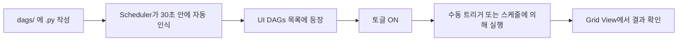

# 05. 첫 번째 DAG 작성

## 사전 준비

[04. 로컬 환경 구축](04-로컬환경구축.md)이 완료되어 Web UI가 보이는 상태여야 합니다.

## DAG 파일 작성 흐름



## 학습용 DAG: `01_hello_airflow.py`

이미 `dags/01_hello_airflow.py`로 추가되어 있습니다. 코드를 한 줄씩 살펴봅시다.

```python
from __future__ import annotations
from datetime import datetime
from airflow import DAG
from airflow.operators.bash import BashOperator
from airflow.operators.python import PythonOperator


def say_hello(**context):
    print("Hello, Airflow!")
    print(f"이 Task의 logical_date: {context['logical_date']}")
    return "hello-from-python"


with DAG(
    dag_id="01_hello_airflow",
    description="가장 단순한 학습용 DAG",
    start_date=datetime(2026, 1, 1),
    schedule="@daily",
    catchup=False,
    tags=["learning", "intro"],
) as dag:
    start = BashOperator(task_id="start", bash_command="echo '=== DAG 시작 ==='")
    hello = PythonOperator(task_id="say_hello", python_callable=say_hello)
    end   = BashOperator(task_id="end",   bash_command="echo '=== DAG 종료 ==='")

    start >> hello >> end
```

### 줄별 해설

| 코드 | 의미 |
|------|------|
| `from __future__ import annotations` | Python 3.7+ 호환 type hint 문법 활성화 |
| `with DAG(...) as dag:` | DAG context manager. 이 블록 안의 Operator는 자동으로 이 DAG에 속함 |
| `dag_id` | UI에 보이는 DAG 이름. **유일해야 함** |
| `start_date` | 이 시각 이후의 logical_date에 대해서만 DAGRun이 만들어짐 |
| `schedule="@daily"` | 매일 자정 (UTC) 기준 실행 |
| `catchup=False` | DAG를 켰을 때 과거를 자동으로 채우지 않음 |
| `task_id` | DAG 내에서 유일한 Task 이름 |
| `start >> hello >> end` | 의존성: start → hello → end 순서로 실행 |

## 실행해보기

### 1) UI에서 DAG 확인

브라우저에서 http://localhost:8080 → 로그인 → DAGs 목록에서 `01_hello_airflow` 확인.

### 2) DAG 토글 ON

DAG 좌측의 토글 스위치를 클릭. 회색 → 파란색으로 변함.

### 3) 트리거

▶ 버튼 클릭 → **Trigger DAG** 선택.

### 4) 결과 확인

DAG 이름 클릭 → **Grid** 탭. 새 컬럼이 생기고 위에서 아래로 녹색이 됩니다.

```
[Grid View ASCII 미리보기]

           start  hello  end
manual...  ✓     ✓      ✓     ← 모두 녹색이면 성공
```

📷 캡처 권장: `docs/images/05-01-grid-success.png`

### 5) 로그 확인

`hello` Task 셀(녹색 박스)을 클릭 → 우측 패널에서 **Logs** 탭.

```
[2026-05-09T...] INFO - Hello, Airflow!
[2026-05-09T...] INFO - 이 Task의 logical_date: 2026-05-09T00:00:00+00:00
[2026-05-09T...] INFO - Done. Returned value was: hello-from-python
```

📷 캡처 권장: `docs/images/05-02-task-logs.png`

## DAG 작성 시 자주 하는 실수

### 1) 같은 DAG에서 Task가 보이지 않는다

- `with DAG(...)` 블록 **밖에서** Operator를 만들면 어느 DAG에도 속하지 않습니다.
- 또는 `BashOperator(task_id=...)`를 변수에 할당하기만 하고 의존성 표기가 빠지면 그래프에 안 그려집니다 (실행은 됨).

### 2) Top-level에서 무거운 코드를 실행

```python
# ❌ 잘못된 예
import requests
data = requests.get("https://api.example.com").json()  # 매 파싱마다 API 호출됨!

with DAG(...) as dag:
    BashOperator(task_id="t", bash_command=f"echo {data}")
```

DAG 파일은 **Scheduler가 매번 파싱**하므로, 모듈 최상위 레벨의 코드는 매번 실행됩니다.
무거운 작업은 반드시 **Operator 안**(즉 Task 실행 시점)으로 옮기세요.

### 3) start_date를 동적으로 둠

```python
start_date=datetime.now()   # ❌ 절대 금지
```

→ 파싱할 때마다 값이 변해서 logical_date 계산이 무너집니다. **항상 고정된 datetime**.

### 4) DAG 객체를 모듈 외부로 노출 안 함

`with DAG(...) as dag:` 패턴이면 OK. 하지만 함수 안에서 만들면 모듈 import 시 보이지 않을 수 있습니다.

```python
# ✅ TaskFlow API
@dag(start_date=datetime(2026,1,1), schedule="@daily", catchup=False)
def my_pipeline():
    ...

my_pipeline()  # ← 모듈 레벨에서 호출하여 DAG 객체 생성!
```

## DAG 미리 검증하기

코드 수정 후 UI에 띄우기 전에 파싱 오류를 먼저 잡으려면:

```bash
docker compose exec airflow-scheduler airflow dags list-import-errors
docker compose exec airflow-scheduler python /opt/airflow/dags/01_hello_airflow.py
```

두 번째 명령은 DAG 파일을 그대로 Python으로 실행 → import error가 있으면 즉시 표면화.

## 다음으로

→ [06. Web UI 개요](06-WebUI-개요.md)
