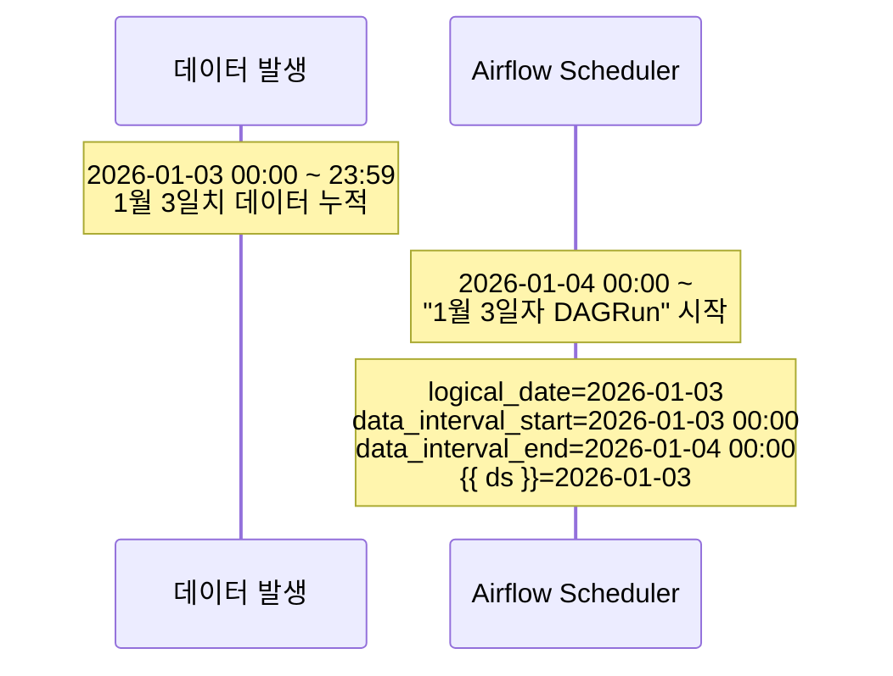
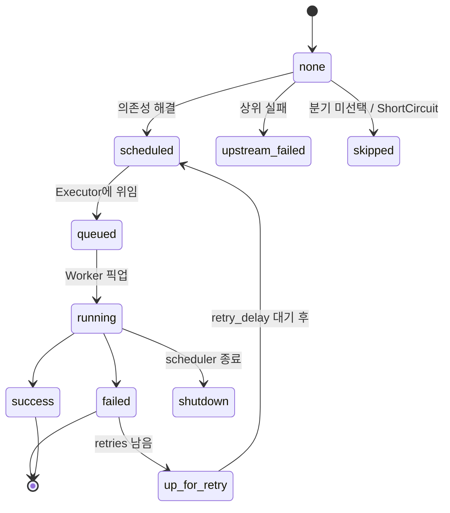

# 09. DAG 실행 메커니즘

`logical_date`, `data_interval`, `schedule`이 어떻게 맞물리는지 정확히 이해해야 단일 실행과 백필을 의도대로 쓸 수 있습니다.

## "어제 데이터를 처리한다"의 의미



**Airflow는 "데이터 구간이 끝난 직후" 그 구간의 데이터를 처리하는 모델입니다.**
이 한 줄을 외우면 logical_date 헷갈림이 거의 풀립니다.

## 핵심 시간 변수 5종

| 변수 | 의미 | `@daily`, 1/3 DAGRun 예시 |
|------|------|---------------------------|
| `logical_date` | DAGRun이 "논리적으로 표상하는 시점" | 2026-01-03 00:00:00 UTC |
| `data_interval_start` | 처리할 데이터 구간의 **시작** (포함) | 2026-01-03 00:00:00 UTC |
| `data_interval_end` | 처리할 데이터 구간의 **끝** (미포함) | 2026-01-04 00:00:00 UTC |
| 실제 실행 시각 | DAGRun이 실제로 돌기 시작한 시각 | 2026-01-04 00:00:01 UTC 정도 |
| `ds` | logical_date의 날짜 (YYYY-MM-DD) | "2026-01-03" |

> **현대 Airflow (2.2+)에서: `logical_date == data_interval_start`**

## "next_run"의 의미

UI의 `next` 컬럼이 `2026-01-03 00:00`이라면:

- 이 DAGRun의 **logical_date**가 1/3
- 실제 실행 시작은 **1/4 00:00 (UTC)**

처음에는 헷갈리지만, 위 시간 모델을 기억하면 "1일치 데이터를 다 받은 후 처리"라는 일관된 의미가 보입니다.

## schedule 표현 형태

```python
schedule="@daily"            # cron preset
schedule="0 3 * * *"         # cron string
schedule=timedelta(hours=6)  # timedelta (interval 표현)
schedule=None                # 수동 트리거 전용
schedule="@once"             # 1회만
schedule=Dataset("s3://...") # Dataset 트리거 (2.4+)
```

### cron preset 일람

| preset | 동등 cron | 의미 |
|--------|----------|------|
| `@once` | (없음) | 1회 |
| `@hourly` | `0 * * * *` | 매시 0분 |
| `@daily` (= `@midnight`) | `0 0 * * *` | 매일 자정 (UTC) |
| `@weekly` | `0 0 * * 0` | 매주 일요일 자정 |
| `@monthly` | `0 0 1 * *` | 매월 1일 자정 |
| `@quarterly` | `0 0 1 */3 *` | 분기마다 |
| `@yearly` (= `@annually`) | `0 0 1 1 *` | 매년 1/1 자정 |

### cron 5필드

```
* * * * *
│ │ │ │ │
│ │ │ │ └── 요일 (0-6, 0=일)
│ │ │ └──── 월   (1-12)
│ │ └────── 일   (1-31)
│ └──────── 시   (0-23)
└────────── 분   (0-59)
```

## DAGRun이 만들어지는 조건

Scheduler는 매 사이클(보통 5초)마다 다음을 점검:

1. DAG 토글이 **ON**인가?
2. `start_date` 이후이고 `end_date` 이전인가?
3. **다음 logical_date가 도래**했는가? (즉 `data_interval_end <= now`)
4. `max_active_runs` 한도에 미치는가?
5. 같은 logical_date의 DAGRun이 **존재하지 않는가**?
6. 의존하는 Dataset이 모두 갱신되었는가? (Dataset 스케줄인 경우)

모두 OK면 DAGRun을 새로 만들고 첫 Task를 큐잉.

## TaskInstance 상태 전이



| 상태 | 의미 |
|------|------|
| `none` | 아직 스케줄 안 됨 |
| `scheduled` | 실행 대기열에 진입 예정 |
| `queued` | Executor 큐에 들어감 |
| `running` | Worker가 실행 중 |
| `success` | 성공 |
| `failed` | 실패 (재시도 끝) |
| `up_for_retry` | 실패했으나 재시도 예정 |
| `up_for_reschedule` | Sensor가 reschedule 모드로 대기 |
| `skipped` | 분기 / ShortCircuit으로 건너뜀 |
| `upstream_failed` | 상위 Task 실패로 자동 실패 |
| `shutdown` | Scheduler가 강제 종료 |
| `removed` | DAG에서 Task 제거됨 |

## "왜 내 DAG가 안 돌아요?" 체크리스트

1. **DAG 토글이 OFF인가?** → ON
2. **`catchup=False`인데 새로 켰나?** → schedule 다음 시점이 와야 첫 DAGRun이 생김
3. **start_date가 미래인가?** → start_date 이후가 되어야 시작
4. **`max_active_runs=1`인데 이전 DAGRun이 멈춰 있나?** → Grid View에서 노란/빨간 셀 확인
5. **Scheduler가 죽었나?** → `docker compose ps`
6. **DAG 파싱 오류인가?** → `airflow dags list-import-errors`
7. **다른 DAGRun이 Pool 슬롯을 다 점유했나?** → Admin → Pools

## depends_on_past

Task에 `depends_on_past=True`를 주면, **같은 Task의 직전 logical_date가 success일 때만** 실행됩니다.
순차 처리가 필수인 ETL에서 유용하지만 백필 시 실패 1개로 뒤가 모두 막힐 수 있어 주의.

## wait_for_downstream

Task에 `wait_for_downstream=True`를 주면, **이전 logical_date의 모든 downstream이 끝나야** 이번 Task가 시작.

## 핵심 정리

```
logical_date = data_interval_start  (현대 Airflow)
data_interval_end = 다음 schedule tick = 실제 실행 시작 시각
ds = logical_date.strftime("%Y-%m-%d")

@daily DAG, "1월 3일치 데이터 처리"
→ logical_date = 2026-01-03
→ data_interval_start = 2026-01-03 00:00
→ data_interval_end   = 2026-01-04 00:00
→ {{ ds }} = "2026-01-03"
→ 실제 실행 시작 = 2026-01-04 00:00 직후
```

## 다음으로

→ [10. Web UI에서 단일 실행](10-단일실행-Trigger.md)
