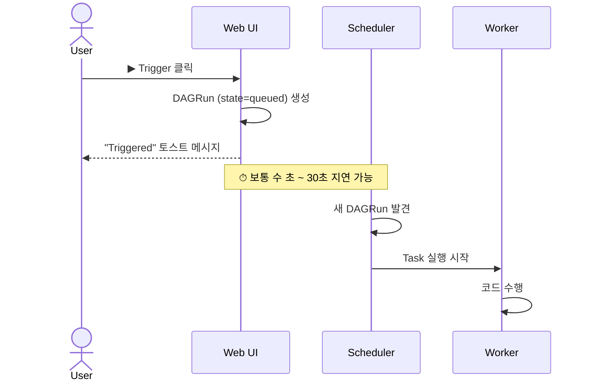

# 10. Web UI에서 단일 실행 (Trigger DAG) ★

스케줄과 무관하게 DAG를 **딱 한 번** 돌리고 싶을 때 쓰는 기능입니다.

## 언제 쓰나?

- 새로 작성한 DAG가 잘 동작하는지 **즉시** 확인하고 싶을 때
- 임시로 특정 파라미터(`conf`)를 주고 일회성 작업을 돌리고 싶을 때
- 자동 스케줄이 꺼져 있는 DAG (`schedule=None`)를 실행할 때

## ▶ 버튼 위치

DAG 목록 페이지 또는 DAG 상세 페이지의 우측 상단에 ▶(재생) 버튼이 있습니다.

```
[DAG 상세 화면 헤더 ASCII 미리보기]

┌────────────────────────────────────────────────────────────────────┐
│  04_backfill_demo                                                  │
│  Schedule: @daily   Owner: airflow   Last run: 2026-01-03          │
│                                  ┌─────────┐ ┌─────────┐ ┌──────┐ │
│                                  │   ▶     │ │  ⟳ Re   │ │ ⋮    │ │
│                                  │ Trigger │ │ -play   │ │ More │ │
│                                  └─────────┘ └─────────┘ └──────┘ │
└────────────────────────────────────────────────────────────────────┘
```

📷 캡처 권장: `docs/images/10-01-trigger-button.png`

## 두 가지 방식

▶ 버튼을 클릭하면 다음과 같은 드롭다운이 펼쳐집니다.

| 메뉴 | 의미 |
|------|------|
| **Trigger DAG** | 즉시 1회 실행 (기본 설정으로) |
| **Trigger DAG w/ config** | conf JSON / Logical Date를 직접 지정해서 실행 |

### A. Trigger DAG (기본)

- 버튼 한 번 누르면 끝
- `logical_date` = **현재 시각**
- `dag_run.conf` = `{}`
- `run_id` = `manual__2026-01-03T12:34:56.123456+00:00` 형태

### B. Trigger DAG w/ config (커스텀 실행)

폼 화면이 뜨고 다음을 직접 지정할 수 있습니다.

```
┌────────────────────────────────────────────────────┐
│ Trigger DAG: 03_branching_example                  │
├────────────────────────────────────────────────────┤
│  Logical Date  [ 2026-01-03 03:00:00      ] (UTC)  │
│                                                     │
│  Configuration JSON                                 │
│  ┌──────────────────────────────────────────────┐   │
│  │ {                                            │   │
│  │   "mode": "premium",                         │   │
│  │   "user_id": 42                              │   │
│  │ }                                            │   │
│  └──────────────────────────────────────────────┘   │
│                                                     │
│  ─── Params (DAG에 정의된 경우 폼이 자동 생성됨) ───  │
│  region: [ kr ▾ ]                                  │
│  limit:  [ 1000     ]                              │
│                                                     │
│           [ Cancel ]      [ Trigger ]               │
└────────────────────────────────────────────────────┘
```

📷 캡처 권장: `docs/images/10-02-trigger-config-modal.png`

## Logical Date 입력 시 주의

| 입력 방식 | 결과 |
|----------|------|
| 비워두면 | 현재 시각이 logical_date로 들어감 |
| `2026-01-03 00:00:00` 입력 | 그 시각이 logical_date로 들어감 (`{{ ds }}` = `2026-01-03`) |
| 입력 timezone | UI 우측 상단 시계 아이콘에서 변경 가능 (UTC / Local / DAG TZ) |

> ⚠️ **logical_date를 과거로 지정한다고 백필이 되는 것은 아닙니다.**
> "한 개의 DAGRun이 그 logical_date 값을 가질 뿐"이며, 그 사이의 다른 날짜는 채워지지 않습니다.
> 여러 날짜를 한꺼번에 처리하고 싶다면 [11. 백필](11-백필-WebUI.md)을 사용하세요.

## conf JSON 사용 예

DAG에서 `dag_run.conf`로 받습니다.

```python
def choose_branch(**context):
    conf = context["dag_run"].conf or {}
    mode = conf.get("mode", "basic")
    return f"process_{mode}"
```

또는 Jinja Template으로:

```jinja
{{ dag_run.conf.get('mode', 'basic') }}
```

> `conf`는 **JSON-serializable**해야 합니다. (datetime, set 등은 직접 못 넣음)

## Params로 폼 자동 생성

`Param` 클래스를 사용하면 위 화면에 입력 필드가 자동 생성됩니다.

```python
from airflow.models.param import Param

with DAG(
    dag_id="my_dag",
    params={
        "region": Param("kr", type="string", enum=["kr", "us", "jp"]),
        "limit":  Param(1000, type="integer", minimum=1, maximum=10000),
        "dry_run": Param(False, type="boolean"),
    },
):
    ...
```

→ Trigger 화면에 region 드롭다운, limit 숫자 입력, dry_run 체크박스가 자동으로 나타남.

```jinja
{{ params.region }}    "kr"
{{ params.limit }}     1000
{{ params.dry_run }}   False
```

## 트리거 후 일어나는 일



→ Grid View에서 새 컬럼이 생기고, 회색(queued) → 라이트 그린(running) → 녹색(success) 순으로 변합니다.

## 자주 묻는 것

### Q1. ▶ 눌렀는데 바로 안 돌아요

- Scheduler가 살아 있는지 확인:
  ```bash
  docker compose ps airflow-scheduler
  ```
- DAG의 토글이 꺼져 있어도 트리거는 가능합니다. 단 **다음 Task로 넘어가지 않을** 수 있으니 켜는 게 좋습니다.
- max_active_runs로 제한이 걸려 있다면 기존 실행이 끝날 때까지 queued로 머뭅니다.

### Q2. 같은 logical_date로 두 번 트리거할 수 있나요?

수동 트리거는 trigger 시각에 마이크로초 단위까지 들어가므로 일반적으로 충돌 안 납니다. 다만 **Logical Date를 직접 입력해서 동일 값으로 두 번** 시도하면 `DuplicateRunException`이 납니다.

### Q3. 토글이 꺼져 있는데 트리거하면?

DAGRun은 생성됩니다. 다만 일부 운영자(예: SubDagOperator)는 토글 상태에 따라 다르게 동작할 수 있고, **자동 스케줄링은 안 일어납니다.**

### Q4. CLI로도 같은 일 가능한가요?

```bash
# 기본
docker compose exec airflow-scheduler \
  airflow dags trigger 03_branching_example

# conf 전달
docker compose exec airflow-scheduler \
  airflow dags trigger -c '{"mode":"premium"}' 03_branching_example

# logical_date 지정
docker compose exec airflow-scheduler \
  airflow dags trigger --logical-date "2026-01-03T00:00:00+00:00" 03_branching_example
```

## 실습

1. UI에서 `03_branching_example` DAG 토글 ON
2. ▶ → **Trigger DAG w/ config**
3. Configuration JSON에 `{"mode": "premium"}` 입력
4. **Trigger** 클릭
5. Grid View에서 새 컬럼 확인 → `process_premium`만 녹색, `process_basic`은 회색(skipped)
6. 다시 트리거하되 `{"mode": "basic"}`으로 → 반대 결과 확인

## 다음으로

→ [11. Web UI에서 백필](11-백필-WebUI.md)
