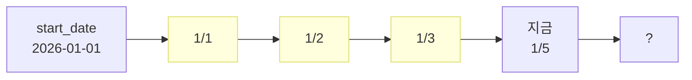

# 13. Catchup과 Schedule 동작

`catchup=True`와 `catchup=False`의 차이를 정확히 이해하면 백필이 더 명확해집니다.

## catchup이란?

DAG의 토글이 처음 ON으로 바뀌었을 때, **start_date부터 지금까지의 모든 schedule 시점**에 대해 DAGRun을 자동으로 만들지 여부.



위처럼 1/1~1/3 사이 DAGRun이 비어 있고 오늘이 1/5이라면:

| 설정 | 동작 |
|------|------|
| `catchup=True` | DAG ON 시 1/1, 1/2, 1/3, 1/4 DAGRun을 한꺼번에 만들어서 자동 실행 |
| `catchup=False` | DAG ON 이후의 다음 logical_date(1/5)부터만 실행. 과거는 무시 |

## 예시 비교

### catchup=False (권장 기본값)

```python
with DAG(
    dag_id="my_dag",
    start_date=datetime(2026, 1, 1),
    schedule="@daily",
    catchup=False,
):
    ...
```

오늘이 1/5에 DAG ON →
- 첫 DAGRun은 **다음 schedule tick에 만들어짐** (logical_date=1/5, 실행은 1/6 00:00 직후)
- 1/1~1/4는 **자동으로 채워지지 않음**

### catchup=True

```python
with DAG(
    dag_id="my_dag",
    start_date=datetime(2026, 1, 1),
    schedule="@daily",
    catchup=True,
):
    ...
```

오늘이 1/5에 DAG ON →
- 1/1, 1/2, 1/3, 1/4 DAGRun이 **즉시 큐잉**
- `max_active_runs`만큼 동시 실행되며 빠르게 채워짐

## "백필"과 "catchup"의 차이

| 기능 | catchup | backfill |
|------|---------|----------|
| 누가 시작? | Scheduler가 자동 (DAG ON 시) | 사용자가 수동 (UI 또는 CLI) |
| 시점 | DAG가 처음 ON 될 때 1회 | 운영 중 언제든 |
| 범위 | start_date ~ 현재 | 명시한 from~to |
| run_type | `scheduled` | `backfill` |

→ 즉 catchup은 **자동 백필의 특수한 형태**입니다.

## 권장 운영 패턴

| 상황 | 권장 |
|------|------|
| 새 DAG 작성 후 처음 켤 때 | `catchup=False`로 두고, 필요한 과거만 **명시적으로 backfill** |
| 데이터가 정말 처음부터 다 필요 | `catchup=True` + `max_active_runs` 작게 (1~4) |
| 일일 ETL인데 며칠 빠뜨림 | `catchup=False` 유지 + 빠진 구간만 **수동 backfill** |

> **이유**: `catchup=True`로 켰다가 실수로 끄면 다시 켤 때 또 누락분을 자동으로 채우려고 시도해서 데이터가 중복/오염될 위험이 있습니다.

## max_active_runs

DAG의 동시 실행 DAGRun 수 상한.

```python
with DAG(..., max_active_runs=1) as dag:
    ...
```

| 값 | 의미 |
|---|------|
| `1` | 직렬 실행. depends_on_past 없는 ETL의 안전한 기본값 |
| `8` | 8개까지 동시. 백필 속도 빠르나 외부 시스템 부하 주의 |
| (생략) | 기본값 16 |

## max_active_tasks

DAG 안에서 동시에 running일 수 있는 **Task** 수 상한.

```python
with DAG(..., max_active_tasks=4) as dag:
    ...
```

→ DAGRun이 여러 개 동시에 돌아도 합산하여 4개까지만 동시 실행.

## DAG 단위 vs Task 단위 동시성

```
DAG.max_active_runs       = DAG의 동시 DAGRun 상한
DAG.max_active_tasks      = DAG 전체에서 동시 Task 상한
Task.max_active_tis_per_dag = 같은 Task가 여러 DAGRun에 걸쳐 동시 실행 상한
Task.priority_weight        = Task의 우선순위 (Pool 안에서)
Pool                        = 여러 Task에 공유되는 슬롯 풀
```

`Pool`은 Admin → Pools에서 만들어 외부 자원(DB 연결 등)을 보호.

```python
PostgresOperator(
    task_id="t",
    pool="postgres_etl",         # Pool 이름
    pool_slots=1,                # 이 Task가 차지할 슬롯 수
    sql="...",
)
```

## 실험으로 익히기

### 실험 1: catchup=False vs True

1. `04_backfill_demo.py`에서 `start_date`를 1주일 전으로, `catchup=True`로 둔다
2. DAG ON → 7일치 DAGRun이 만들어지는지 Grid View 확인
3. `catchup=False`로 바꾸고 새 DAG로 복제 → DAG ON → 1개만 만들어지는지 확인

### 실험 2: max_active_runs 효과

1. `04_backfill_demo.py`에서 `max_active_runs=1` → CLI로 백필 7일치
2. Grid View에서 한 번에 한 개씩만 running으로 표시되는 것 확인
3. `max_active_runs=4`로 바꾸고 다시 백필 → 4개씩 동시 실행되는지 확인

## 다음으로

→ [14. Jinja Template 기초](14-Jinja-Template.md)
