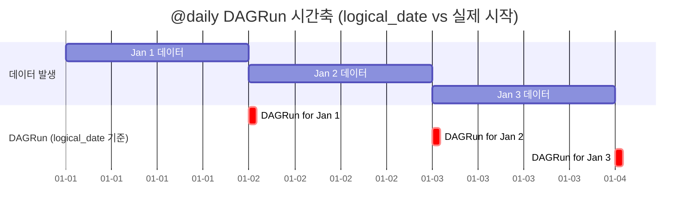

# 15. 예약어 전체 레퍼런스 (★)

이 문서는 Airflow Jinja Template에서 사용 가능한 **모든 예약어**를 빠짐없이 정리한 것입니다.
출처: [Airflow Templates Reference 공식 문서](https://airflow.apache.org/docs/apache-airflow/stable/templates-ref.html)

> 기준 버전: **Airflow 2.9.x**

## 목차

1. [날짜 / 시각 관련 (가장 많이 씀)](#1-날짜--시각-관련-가장-많이-씀)
2. [DAG / Task 메타 정보](#2-dag--task-메타-정보)
3. [DAGRun 정보](#3-dagrun-정보)
4. [Connections / Variables 접근](#4-connections--variables-접근)
5. [params (DAG 정의 시 전달)](#5-params-dag-정의-시-전달)
6. [conf (수동 트리거 시 전달)](#6-conf-수동-트리거-시-전달)
7. [매크로 함수](#7-매크로-함수)
8. [Deprecated된 예약어](#8-deprecated된-예약어)

---

## 1. 날짜 / 시각 관련 (가장 많이 씀)

> 예시 시나리오: `@daily` DAG, `start_date = 2026-01-01`, **2026-01-03**의 DAGRun이 **2026-01-04 00:00 UTC**에 시작되었다고 가정.

| 예약어 | 타입 | 예시 값 | 설명 |
|--------|------|---------|------|
| `{{ ds }}` | `str` | `"2026-01-03"` | logical_date의 날짜 부분 (YYYY-MM-DD). **가장 많이 사용** |
| `{{ ds_nodash }}` | `str` | `"20260103"` | `ds`에서 `-` 제거 (YYYYMMDD) |
| `{{ ts }}` | `str` | `"2026-01-03T00:00:00+00:00"` | logical_date의 ISO 8601 문자열 |
| `{{ ts_nodash }}` | `str` | `"20260103T000000"` | `ts`에서 `:`, `-`, `+` 제거 (timezone 없음) |
| `{{ ts_nodash_with_tz }}` | `str` | `"20260103T000000+0000"` | `ts_nodash`에 timezone 포함 |
| `{{ logical_date }}` | `pendulum.DateTime` | `DateTime(2026, 1, 3, 0, 0, 0, tzinfo=UTC)` | DAGRun의 논리적 시각 (구 `execution_date`) |
| `{{ data_interval_start }}` | `pendulum.DateTime` | `2026-01-03T00:00:00+00:00` | **이 DAGRun이 처리할 데이터 구간의 시작** |
| `{{ data_interval_end }}` | `pendulum.DateTime` | `2026-01-04T00:00:00+00:00` | **데이터 구간의 끝** (포함하지 않음, exclusive) |
| `{{ prev_data_interval_start_success }}` | `pendulum.DateTime \| None` | `2026-01-02T00:00:00+00:00` | 직전에 **성공한** DAGRun의 data_interval_start |
| `{{ prev_data_interval_end_success }}` | `pendulum.DateTime \| None` | `2026-01-03T00:00:00+00:00` | 직전에 **성공한** DAGRun의 data_interval_end |
| `{{ prev_start_date_success }}` | `pendulum.DateTime \| None` | — | 직전 성공 DAGRun의 실제 시작 시각 |
| `{{ next_ds }}` | `str` | `"2026-01-04"` | 다음 logical_date의 날짜 (= data_interval_end의 ds) |
| `{{ next_ds_nodash }}` | `str` | `"20260104"` | `next_ds` 대시 제거 |
| `{{ prev_ds }}` | `str` | `"2026-01-02"` | 이전 logical_date의 날짜 |
| `{{ prev_ds_nodash }}` | `str` | `"20260102"` | `prev_ds` 대시 제거 |

### `logical_date` vs `data_interval_start` 헷갈림 정리

```
@daily 스케줄 + start_date=2026-01-01 인 DAG

         logical_date    data_interval_start    data_interval_end    실제 시작 시각
DAGRun1  2026-01-01     2026-01-01            2026-01-02            2026-01-02 00:00 (UTC)
DAGRun2  2026-01-02     2026-01-02            2026-01-03            2026-01-03 00:00 (UTC)
DAGRun3  2026-01-03     2026-01-03            2026-01-04            2026-01-04 00:00 (UTC) ← 지금
```

**핵심 규칙**:
- `logical_date == data_interval_start` (현대 Airflow에서)
- `data_interval_end - data_interval_start == 1 day` (`@daily`의 경우)
- "어제 데이터를 처리한다" = `WHERE event_date = '{{ ds }}'`
- DAG가 실제로 **돌기 시작**하는 시각은 `data_interval_end` 시점
- 즉 **하루치를 다 채운 직후에 처리를 시작**하는 모델



> **Airflow 2.2 이전**: `execution_date`라는 이름이 logical_date와 동일 의미로 쓰였습니다. 하지만 "실행 시각"으로 오해되는 경우가 많아 deprecated 됐습니다. `{{ execution_date }}`는 여전히 동작하지만 새 코드에서는 `logical_date`를 사용하세요.

### 다양한 schedule에서의 data_interval

| schedule | data_interval_start | data_interval_end | 처리 의미 |
|---------|--------------------|--------------------|----------|
| `@hourly` | `2026-01-03 14:00` | `2026-01-03 15:00` | 14시 1시간치 |
| `@daily` | `2026-01-03 00:00` | `2026-01-04 00:00` | 1월 3일 하루치 |
| `@weekly` | `2026-01-03 00:00 (Sun)` | `2026-01-10 00:00 (Sun)` | 일~토 한 주 |
| `@monthly` | `2026-01-01` | `2026-02-01` | 1월 한 달 |
| `0 3 * * *` | `2026-01-03 03:00` | `2026-01-04 03:00` | 매일 3시 기준 24시간 |
| `None` (수동) | trigger 시각 | trigger 시각 | 구간 의미 없음 |
| `@once` | start_date | start_date | 1회만 |

---

## 2. DAG / Task 메타 정보

| 예약어 | 타입 | 예시 |
|--------|------|------|
| `{{ dag }}` | `DAG` | DAG 객체 |
| `{{ dag.dag_id }}` | `str` | `"04_backfill_demo"` |
| `{{ dag.description }}` | `str` | `"백필 시연용 DAG"` |
| `{{ task }}` | `BaseOperator` | Task 객체 |
| `{{ task.task_id }}` | `str` | `"fake_extract"` |
| `{{ task.owner }}` | `str` | `"airflow"` |
| `{{ task_instance }}` / `{{ ti }}` | `TaskInstance` | TI 객체 (XCom 접근에 사용) |
| `{{ task_instance_key_str }}` | `str` | `"04_backfill_demo__fake_extract__20260103"` |
| `{{ try_number }}` | `int` | `1` (현재 시도 횟수) |
| `{{ map_index }}` | `int` | `-1` (Dynamic Task Mapping에서 사용) |

### XCom 사용 예

```jinja
{{ ti.xcom_pull(task_ids='extract', key='row_count') }}
```

---

## 3. DAGRun 정보

| 예약어 | 타입 | 설명 |
|--------|------|------|
| `{{ dag_run }}` | `DagRun` | DAGRun 객체 |
| `{{ dag_run.run_id }}` | `str` | 예: `scheduled__2026-01-03T00:00:00+00:00`, `manual__...`, `backfill__...` |
| `{{ run_id }}` | `str` | 위와 동일 (편의 변수) |
| `{{ dag_run.run_type }}` | `str` | `scheduled` / `manual` / `backfill` / `dataset_triggered` |
| `{{ dag_run.start_date }}` | `pendulum.DateTime` | 실제 실행 시작 시각 |
| `{{ dag_run.external_trigger }}` | `bool` | 수동 트리거인지 여부 |
| `{{ dag_run.conf }}` | `dict` | 수동 트리거 시 전달한 conf JSON |

### run_id 패턴 정리

| 트리거 방식 | run_id 형태 |
|-----------|------------|
| 자동 스케줄 | `scheduled__2026-01-03T00:00:00+00:00` |
| Web UI ▶ Trigger | `manual__2026-01-03T12:34:56.123456+00:00` |
| CLI `airflow dags backfill` | `backfill__2026-01-03T00:00:00+00:00` |
| Web UI Backfill 모달 | `backfill__...` (CLI와 동일 형식) |
| Dataset 트리거 | `dataset_triggered__...` |

---

## 4. Connections / Variables 접근

```jinja
{{ var.value.<KEY> }}              # Variable의 값 (text)
{{ var.value.get('<KEY>', 'def') }} # 기본값 포함
{{ var.json.<KEY> }}                # Variable의 값을 JSON 파싱
{{ conn.<CONN_ID>.host }}           # Connection의 host
{{ conn.<CONN_ID>.password }}       # Connection의 password
{{ conn.<CONN_ID>.extra_dejson }}   # Connection의 extra (JSON)
```

> Variable, Connection은 [17. Variables/Connections/XCom](17-Variables-Connections-XCom.md) 문서 참고.

---

## 5. params (DAG 정의 시 전달)

DAG 또는 Task에 `params={"my_key": "my_value"}`로 정적인 값을 넘길 수 있습니다.

```python
with DAG(..., params={"region": "kr", "limit": 1000}):
    BashOperator(
        task_id="t",
        bash_command="echo region={{ params.region }} limit={{ params.limit }}",
    )
```

```jinja
{{ params.region }}    → "kr"
{{ params.limit }}     → 1000
```

> `params`는 **Trigger DAG w/ config** 화면에서 사용자가 덮어쓸 수 있습니다 (Param 클래스 활용).

---

## 6. conf (수동 트리거 시 전달)

수동으로 ▶ 버튼이나 CLI로 DAG를 돌릴 때, 자유 형식 JSON을 함께 넘길 수 있습니다.

```jinja
{{ dag_run.conf }}                    → {"mode": "premium", "user_id": 42}
{{ dag_run.conf.get('mode', 'basic') }} → "premium"
{{ dag_run.conf['user_id'] }}         → 42
```

수동 트리거가 아니면 `dag_run.conf`는 빈 dict (`{}`)입니다.

> Web UI에서 conf 입력하는 법은 [10. 단일실행](10-단일실행-Trigger.md) 참고.

---

## 7. 매크로 함수

`{{ macros.* }}` 네임스페이스에서 사용 가능. 자세한 내용은 [16. 매크로함수](16-매크로함수.md).

| 매크로 | 역할 | 예시 |
|--------|------|------|
| `macros.ds_add(ds, days)` | ds 날짜 더하기/빼기 | `{{ macros.ds_add(ds, -7) }}` |
| `macros.ds_format(ds, in_fmt, out_fmt)` | ds 포맷 변경 | `{{ macros.ds_format(ds, '%Y-%m-%d', '%Y%m%d') }}` |
| `macros.datetime` | `datetime` 모듈 | `{{ macros.datetime.now().isoformat() }}` |
| `macros.timedelta` | `timedelta` 클래스 | `{{ logical_date - macros.timedelta(days=1) }}` |
| `macros.dateutil` | `dateutil` 라이브러리 | 복잡한 날짜 파싱 |
| `macros.uuid` | `uuid` 모듈 | `{{ macros.uuid.uuid4() }}` |
| `macros.random` | `random` 모듈 | `{{ macros.random.random() }}` |

---

## 8. Deprecated된 예약어

⚠️ **새 코드에서는 사용하지 마세요.** 호환성을 위해 아직 동작하지만 향후 제거됩니다.

| 구 예약어 | 신 예약어 | 비고 |
|----------|----------|------|
| `{{ execution_date }}` | `{{ logical_date }}` | 2.2부터 deprecated |
| `{{ next_execution_date }}` | `{{ data_interval_end }}` | |
| `{{ prev_execution_date }}` | data_interval 또는 prev_data_interval_start_success | |
| `{{ prev_execution_date_success }}` | `{{ prev_data_interval_start_success }}` | |
| `{{ tomorrow_ds }}` | `{{ macros.ds_add(ds, 1) }}` | |
| `{{ yesterday_ds }}` | `{{ macros.ds_add(ds, -1) }}` | |
| `{{ tomorrow_ds_nodash }}` | `{{ macros.ds_format(macros.ds_add(ds, 1), '%Y-%m-%d', '%Y%m%d') }}` | |
| `{{ yesterday_ds_nodash }}` | 동일 패턴 | |

---

## 한 장 요약 (치트시트)

```
[날짜]
  ds                       2026-01-03
  ds_nodash                20260103
  ts                       2026-01-03T00:00:00+00:00
  logical_date             pendulum DateTime
  data_interval_start      처리 데이터 구간 시작 (포함)
  data_interval_end        처리 데이터 구간 끝   (미포함)
  prev_ds / next_ds        하루 전 / 후

[메타]
  dag.dag_id, task.task_id
  task_instance / ti       (XCom 접근)
  run_id, dag_run.conf

[자주 쓰는 패턴]
  WHERE dt = '{{ ds }}'                          ← 가장 많음
  /data/snapshot_{{ ds_nodash }}.parquet
  WHERE ts >= '{{ data_interval_start }}'
    AND ts <  '{{ data_interval_end }}'          ← 정석
  {{ macros.ds_add(ds, -1) }}                    ← 어제
  {{ dag_run.conf.get('region', 'kr') }}         ← 수동 conf
```

## 직접 확인하기

`dags/02_template_variables.py`를 트리거하면 위 모든 값이 한 번에 출력됩니다.

```bash
docker compose exec airflow-scheduler airflow dags trigger 02_template_variables
docker compose exec airflow-scheduler airflow tasks logs 02_template_variables print_via_bash <run_id>
```

또는 Web UI에서 트리거 후 Logs 탭 확인.

## 다음으로

→ [16. 매크로 함수 상세](16-매크로함수.md)
