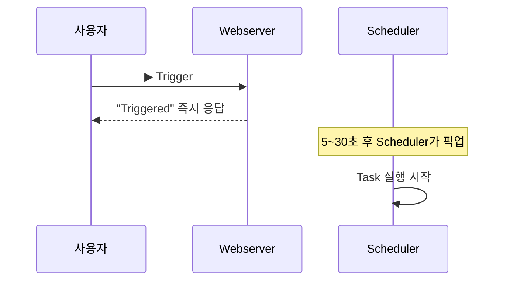

# 21. 트러블슈팅 FAQ

학습 중 자주 막히는 지점을 증상 → 원인 → 해결 순으로 정리했습니다.

## 목차

- [환경 / 설치](#환경--설치)
- [DAG가 UI에 안 보임](#dag가-ui에-안-보임)
- [DAG가 자동 실행 안 됨](#dag가-자동-실행-안-됨)
- [▶ 버튼 / 트리거](#-버튼--트리거)
- [Task 실패 / 멈춤](#task-실패--멈춤)
- [백필 / catchup](#백필--catchup)
- [Jinja Template / 예약어](#jinja-template--예약어)
- [로그가 안 보임](#로그가-안-보임)
- [성능 / 동시성](#성능--동시성)
- [학습 환경 초기화](#학습-환경-초기화)

---

## 환경 / 설치

### Q. 컨테이너가 unhealthy로만 떠 있다

```bash
docker compose ps
# 일부가 unhealthy 또는 starting에서 멈춤
```

**원인 / 해결**

1. **메모리 부족** — Docker Desktop → Settings → Resources에서 4GB 이상 할당
2. **포트 충돌** — 8080 이미 사용 중. 다음 둘 중 하나:
   - 다른 앱 종료
   - `.env`에서 `AIRFLOW_WEBSERVER_PORT=9090` 등으로 변경
3. **권한 문제 (Linux)** — `.env`에서 `AIRFLOW_UID=$(id -u)` 설정

```bash
# 로그로 원인 파악
docker compose logs --tail=100 airflow-scheduler
docker compose logs --tail=100 airflow-webserver
docker compose logs --tail=50 postgres
```

### Q. 처음 docker compose up 했는데 너무 오래 걸린다

이미지 다운로드(~700MB) + DB 마이그레이션 + admin 생성. 처음에는 **5분 이상** 걸릴 수 있습니다.
이후 기동은 30~60초 수준.

### Q. M1/M2 Mac에서 emulation 경고가 뜬다

`apple silicon` 환경에서 `apache/airflow:2.9.3`은 multi-arch이므로 정상 동작합니다.
경고만 뜨고 사용에는 문제 없음.

---

## DAG가 UI에 안 보임

### Q. dags/ 에 .py를 넣었는데 UI에 안 나타남

**원인 / 해결**

1. **파싱 오류** — 가장 흔함
   ```bash
   docker compose exec airflow-scheduler airflow dags list-import-errors
   ```
   → 출력된 파일과 라인 번호의 코드 수정.

2. **DAG 객체가 모듈 최상위에 노출 안 됨**
   ```python
   # ❌ 함수 안에 갇힌 DAG
   def make_dag():
       with DAG(...) as d:
           ...

   # ✅ 모듈 최상위에서 with DAG 또는 호출
   with DAG(...) as dag:
       ...
   # 또는
   @dag(...)
   def my_pipe(): ...
   my_pipe()         # ← 호출해야 DAG 객체 생성됨
   ```

3. **Scheduler가 아직 파싱 안 함** — 30~60초 대기. 또는:
   ```bash
   docker compose restart airflow-scheduler
   ```

4. **dag_id 충돌** — 다른 파일과 동일한 `dag_id`. 변경 후 저장.

### Q. DAG는 보이는데 "Import Error" 표시

UI 상단에 빨간 배너 클릭 → 어떤 파일의 어떤 라인이 문제인지 표시.
또는 CLI:
```bash
docker compose exec airflow-scheduler airflow dags list-import-errors
```

### Q. 코드를 수정했는데 UI에 반영 안 됨

- DAG 상세 화면 → **Code** 탭에서 새 코드인지 확인
- 안 보이면 30초 대기 후 다시 (Scheduler 파싱 주기)
- 그래도 안 되면 import error 확인:
  ```bash
  docker compose exec airflow-scheduler airflow dags list-import-errors
  ```
- 즉시 강제 재직렬화 (Code 탭이 안 갱신될 때):
  ```bash
  docker compose exec airflow-scheduler airflow dags reserialize
  ```

---

## DAG가 자동 실행 안 됨

### Q. 토글 ON 했는데 자동으로 안 돌아요

**체크리스트**

1. **start_date가 미래?** — start_date 이후 시점이 와야 첫 DAGRun
2. **catchup=False인데 다음 schedule tick이 아직 안 옴?**
   - `@daily`라면 다음 자정(UTC) 이후에 첫 DAGRun
3. **이전 DAGRun이 멈춰 있어 max_active_runs=1로 막혀 있나?**
   - Grid View에 노란/회색 셀이 있는지 확인
4. **schedule이 None?**
   - `schedule=None`은 수동 트리거 전용. 자동 실행 안 함

**즉시 확인**:

```bash
docker compose exec airflow-scheduler airflow dags next-execution <DAG_ID>
```

### Q. Scheduler가 죽어 있는 것 같아요

```bash
docker compose ps airflow-scheduler        # State 확인
docker compose logs --tail=100 airflow-scheduler
```

죽어 있으면:

```bash
docker compose restart airflow-scheduler
```

---

## ▶ 버튼 / 트리거

### Q. ▶ 눌렀는데 즉시 안 돌아요

**즉시 도는 게 아닙니다.** ▶는 "DAGRun을 큐에 등록"까지만 즉시 처리.
실제 실행 시작은 **Scheduler 다음 사이클** (5초 ~ 30초 후).



30초 이상 대기해도 안 돌면:
- Scheduler 살아있는지 확인
- DAG 토글 OFF 아닌지 확인 (트리거는 가능하지만 일부 동작 제한)
- max_active_runs / Pool 슬롯 확인

### Q. Trigger DAG w/ config에서 JSON이 거부됨

- JSON 문법 오류일 수 있음. `{"key": "value"}` (큰따옴표) 사용
- 트레일링 콤마 금지: `{"a": 1,}` ❌ → `{"a": 1}` ✓
- 개행 자유. 공백/탭 OK

### Q. 같은 logical_date로 두 번 트리거하니 에러

`DuplicateRunException` — 같은 logical_date의 DAGRun이 이미 존재.
- Logical Date 입력란을 비워두면 trigger 시각이 들어가므로 충돌 안 남
- 의도적으로 같은 logical_date를 다시 돌리려면 **Clear** (재실행) 사용

---

## Task 실패 / 멈춤

### Q. 한 Task가 빨간색이에요

1. 빨간 셀 클릭 → **Logs** 탭에서 traceback 확인
2. 외부 시스템 일시 장애라면 셀 → **Clear (Downstream)** → 자동 재시도
3. 코드 버그라면 코드 수정 → 30초 대기 → Clear

### Q. Task가 며칠째 running인데 안 끝남

```bash
# 1) 컨테이너 상태
docker compose ps

# 2) 해당 Task의 hostname 확인 (UI Details 탭)

# 3) 강제 종료 (UI에서)
#    행 헤더 클릭 → Mark as failed
```

또는 CLI:
```bash
airflow tasks clear <DAG_ID> -t <TASK_ID> -s ... -e ... -y
```

### Q. Task가 queued에서 안 움직여요

원인:
- **Pool 슬롯 부족** — Admin → Pools 확인
- **Executor 슬롯 부족** — `max_active_tasks` 또는 `parallelism` 확인
- **Worker가 죽었음** — Scheduler 로그 확인

### Q. up_for_retry가 계속 반복돼요

`retries`만큼 시도 후에도 계속 실패하면 결국 failed로 갑니다.
원인 파악이 우선:
1. **Logs 탭의 모든 시도(try) 확인** — 매번 같은 에러? 다른 에러?
2. 외부 시스템 / 네트워크 / 권한 / 타임아웃 검토

### Q. Task가 `upstream_failed`로 떴어요

이 Task 자체의 문제 아님. **상위 Task가 실패**해서 자동으로 못 돌게 된 것.
상위 Task를 먼저 고치고 Clear.

---

## 백필 / catchup

### Q. catchup=True로 두고 DAG ON 했더니 수개월치가 한꺼번에 큐잉됐어요

**자주 하는 실수.** 두 가지 대응:

1. **즉시 멈추기**: DAG 토글 OFF → 잘못된 DAGRun들을 UI에서 일괄 삭제
2. **사후 정리**:
   ```bash
   airflow tasks clear <DAG_ID> -s 2025-01-01 -e 2026-01-01 -y
   # 또는 DAGRun 자체 삭제
   ```

**예방**: `catchup=False`로 두고 필요한 과거만 명시적 백필.

### Q. 백필 명령을 돌려도 새 DAGRun이 안 만들어져요

```bash
airflow dags backfill -s 2026-04-01 -e 2026-04-05 my_dag
```

원인:
- **이미 같은 logical_date의 DAGRun이 존재** → `--reset-dagruns -y` 추가
- DAG가 paused — 트리거는 되지만 Task 큐잉이 막힐 수 있음 → DAG ON
- start_date가 백필 범위보다 미래

먼저 dry-run:
```bash
airflow dags backfill ... --dry-run
```

### Q. 백필 도중 일부 실패. 실패한 것만 다시 돌리려면?

```bash
airflow dags backfill -s ... -e ... --rerun-failed-tasks <DAG_ID>
```

### Q. logical_date 1개로 ▶ Trigger w/ Logical Date 했는데 백필 효과 안 남

수동 트리거는 1개의 DAGRun만 만듭니다. **여러 날짜 = 백필** 사용.

---

## Jinja Template / 예약어

### Q. `{{ ds }}`가 그대로 출력됐어요 (치환 안 됨)

**원인**: 그 인자가 `template_fields`에 없음.
- `BashOperator.template_fields = ('bash_command', 'env', 'cwd')`
- 다른 필드(예: `task_id`)에 `{{ }}` 써도 치환 안 됨

**확인**: 셀 클릭 → **Rendered Template** 탭에서 어떤 필드가 어떤 값으로 치환됐는지 보기.

### Q. PythonOperator에서 `{{ ds }}`를 쓰고 싶어요

`python_callable`은 함수 객체이므로 직접 Jinja 안 됨. 3가지 방법:

```python
# 1) **context로 받기
def f(**context):
    print(context["ds"])

# 2) op_kwargs (template_fields)
def f(today): print(today)
PythonOperator(task_id="t", python_callable=f, op_kwargs={"today": "{{ ds }}"})

# 3) get_current_context (TaskFlow API)
from airflow.operators.python import get_current_context
@task
def f():
    ctx = get_current_context()
    print(ctx["ds"])
```

### Q. logical_date가 오늘이 아니에요. 어제가 나와요

**정상.** Airflow는 "데이터 구간이 끝난 직후" 그 구간의 DAGRun을 시작합니다.
오늘 새벽에 실제로 돈 DAGRun의 logical_date는 **어제 날짜**가 정상.

→ [09. DAG 실행 메커니즘](09-DAG-실행메커니즘.md)

### Q. timezone이 안 맞아요. KST로 보고 싶어요

- **UI 표기만 변경**: 우측 상단 🕒 → Local
- **DAG의 schedule을 KST 기준으로**: pendulum timezone 사용
  ```python
  import pendulum
  start_date=pendulum.datetime(2026, 1, 1, tz="Asia/Seoul")
  ```

logical_date는 메타DB에 항상 UTC로 저장됩니다.

---

## 로그가 안 보임

### Q. Logs 탭이 비어 있어요

1. **Task 상태가 queued** → 아직 시작 안 함. 실행 시작해야 로그 생김
2. **로그 파일 권한 문제** (Linux):
   ```bash
   sudo chown -R $(id -u):0 logs/
   # .env에서 AIRFLOW_UID=$(id -u) 다시 확인
   ```
3. **Worker / Scheduler 컨테이너가 같은 logs 볼륨을 공유하는지** 확인

### Q. 로그가 너무 많아 못 찾겠어요

- UI Logs 탭 우측 상단 search box 사용
- 또는 컨테이너에서 grep:
  ```bash
  docker compose exec airflow-scheduler \
    grep -r "ERROR" /opt/airflow/logs/dag_id=my_dag/
  ```

### Q. 로그를 외부(S3)로 보내고 싶어요

`.env`에서 다음 활성화 (학습 환경에서는 불필요):
```bash
AIRFLOW__LOGGING__REMOTE_LOGGING=True
AIRFLOW__LOGGING__REMOTE_BASE_LOG_FOLDER=s3://my-bucket/airflow-logs
AIRFLOW__LOGGING__REMOTE_LOG_CONN_ID=aws_default
```

---

## 성능 / 동시성

### Q. 백필이 너무 느려요

- `max_active_runs`를 늘림 (DAG 정의 또는 백필 명령)
- Pool 슬롯 부족이면 늘림
- Task 자체가 느린 경우 (외부 시스템) — 동시성으로 해결 안 됨

### Q. Task가 너무 많이 동시 실행돼서 외부 시스템 부하

- DAG: `max_active_tasks=N`
- 같은 Task의 logical_date 간 동시성: `Task.max_active_tis_per_dag=N`
- 외부 자원 보호: Pool 사용 (Admin → Pools)

### Q. Scheduler CPU가 100%

DAG 파싱이 느린 경우. 확인:

```bash
airflow dags list-import-errors
```

원인:
- **DAG 파일 최상위에서 무거운 작업** (DB 쿼리, API 호출 등) → 함수 안으로
- DAG 파일이 너무 많음 (>500개) → `min_file_process_interval` 조정

---

## 학습 환경 초기화

### Q. 처음부터 다시 시작하고 싶어요

```bash
# DB까지 다 날림 (모든 이력 삭제)
docker compose down -v

# 재초기화
docker compose up airflow-init
docker compose up -d
```

### Q. DAG의 모든 이력만 삭제하고 싶어요

```bash
docker compose exec airflow-scheduler \
  airflow db clean --tables dag_run,task_instance,xcom \
                   --clean-before-timestamp '2026-01-01 00:00:00+00:00'
```

또는 UI에서 DAG 이름 옆 ⋮ → **Delete DAG** (코드 파일은 그대로).

### Q. 메타DB의 특정 DAGRun만 삭제

UI Grid View → 행 헤더 클릭 → 우측 패널 → **Delete DAG Run**.

---

## 추가 도움

- 본 가이드의 [18. 실전 시나리오](18-실전시나리오.md) — 더 큰 사례별 처방
- 공식 FAQ: https://airflow.apache.org/docs/apache-airflow/stable/faq.html
- 한국 사용자 모임 (검색): "Apache Airflow 한국"

## 다음으로

→ 본 가이드 처음으로: [00. 30분 퀵스타트](00-30분-퀵스타트.md) 또는 [README](../README.md)
